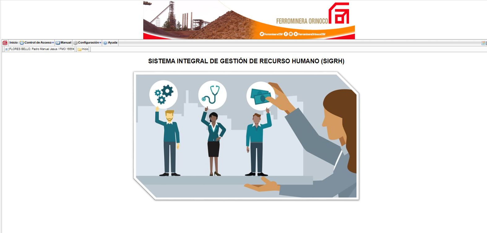
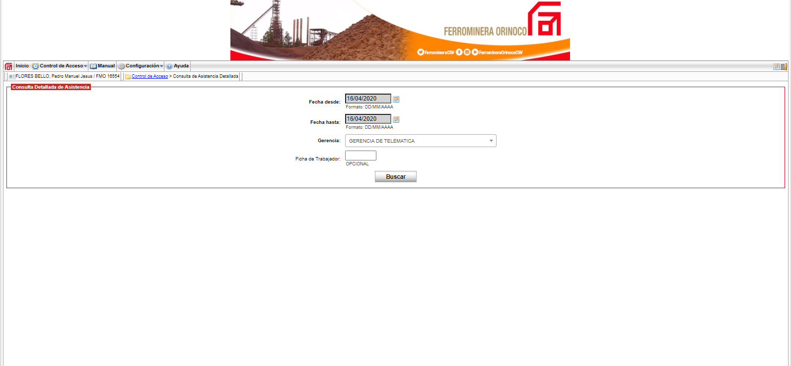
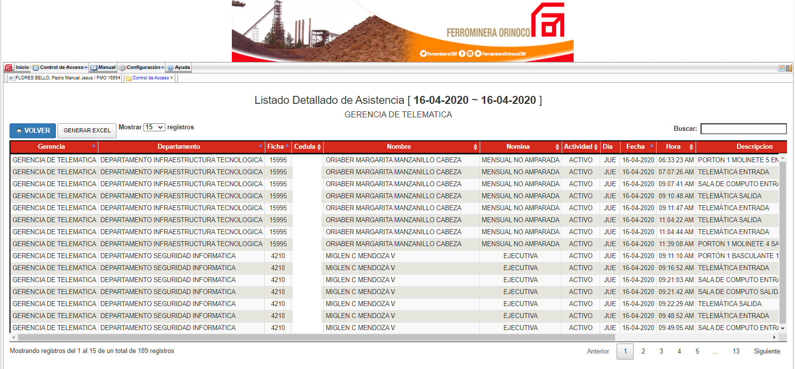

# Project Name

SIGRH (Sistema Integral de Gestión de Recursos Humanos) / (Human Resources Management Integral System)

## Project Description

New human resource system replacement of legacy system.

## Technologies

- Zend Framework 1.12
- PHP
- HTML
- CSS
- PostgreSQL

## Screenshots

Here are some screenshots of the project:

You can find more screenshots in the "screenshots" folder of this repository.